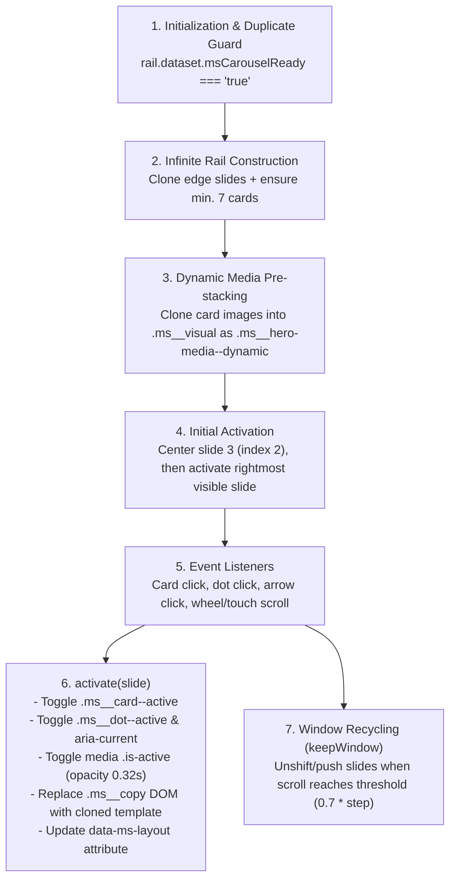

# Editorial Carousel Hero — Comprehensive Handoff & Technical Reference

An Online Store 2.0 dual-panel editorial hero pairing a persistent left copy panel with dynamic right visual media, interactive bottom card rail, and per-card copy transitions.

---

## 1. Executive Overview & File Locations

The **Editorial Carousel Hero** represents an evolution of the furniture showcase pattern into a dynamic editorial story driver. Selecting any card in the bottom rail seamlessly swaps both the primary visual media on the right and the entire left copy block (eyebrow, heading, narrative copy, and CTA) using bespoke layout treatments.

### Active File Locations

| Purpose                      | File Path                                                                                                                                                                                                                                                    |
| :--------------------------- | :----------------------------------------------------------------------------------------------------------------------------------------------------------------------------------------------------------------------------------------------------------- |
| **Live Shopify Section**     | [`sections/editorial-carousel-hero.liquid`](file:///mnt/my_data_1/docs/my-projects/ACTIVE/shopify-themes/source/nigat/sections/editorial-carousel-hero.liquid)                                                                                               |
| **Reusable Library Variant** | [`section-library/banners/hero/editorial-carousel-hero/editorial-carousel-hero.liquid`](file:///mnt/my_data_1/docs/my-projects/ACTIVE/shopify-themes/source/nigat/section-library/banners/hero/editorial-carousel-hero/editorial-carousel-hero.liquid)       |
| **Active Homepage Template** | [`templates/index.json`](file:///mnt/my_data_1/docs/my-projects/ACTIVE/shopify-themes/source/nigat/templates/index.json) (under section key `"editorial-carousel-hero"`)                                                                                     |
| **Variant Readme**           | [`section-library/banners/hero/editorial-carousel-hero/editorial-carousel-hero-readme.md`](file:///mnt/my_data_1/docs/my-projects/ACTIVE/shopify-themes/source/nigat/section-library/banners/hero/editorial-carousel-hero/editorial-carousel-hero-readme.md) |
| **Usage Reference**          | [`section-library/banners/hero/editorial-carousel-hero/usage.md`](file:///mnt/my_data_1/docs/my-projects/ACTIVE/shopify-themes/source/nigat/section-library/banners/hero/editorial-carousel-hero/usage.md)                                                   |
| **Psychology & Strategy**    | [`section-library/banners/hero/editorial-carousel-hero/psychology.md`](file:///mnt/my_data_1/docs/my-projects/ACTIVE/shopify-themes/source/nigat/section-library/banners/hero/editorial-carousel-hero/psychology.md)                                         |

> [!IMPORTANT]
> **Library Synchronization Rule:** The live section (`sections/editorial-carousel-hero.liquid`) and the library copy (`section-library/banners/hero/editorial-carousel-hero/editorial-carousel-hero.liquid`) must remain bit-for-bit identical. Always verify parity using `cmp -s`.

---

## 2. Component Architecture & DOM Structure

The hero is scoped under `#MaterialShowcase-{{ section.id }}` and structured into four coordinated layers:

```
#MaterialShowcase-{{ section.id }}
 └── .ms__canvas (50/50 CSS Grid on desktop; standard block flow on mobile)
      ├── .ms__copy (Left Column: dynamic copy container; updated via <template>)
      │    ├── .ms__eyebrow
      │    ├── .ms__heading
      │    ├── .ms__text
      │    └── .ms__copy-action (CTA button + SVG arrow)
      ├── .ms__visual (Right Column: dominant media container)
      │    ├── .ms__hero-media (Base / static media layer)
      │    ├── .ms__hero-media--dynamic (Cloned media layers toggled by .is-active)
      │    └── .ms__callout (Up to 3 configurable dotted-line material callouts)
      ├── .ms__slider (Absolute desktop bottom strip / normal mobile document flow)
      │    ├── .ms__rail[data-ms-rail] (Horizontally scrolling mini-card track)
      │    │    └── .ms__card (Mini cards; active card receives .ms__card--active)
      │    └── .ms__navigation (Controls container)
      │         ├── .ms__dots (Pill / dot pagination indicators)
      │         └── .ms__arrows (Circular prev/next navigation buttons)
      └── [hidden] (Template store)
           └── template[data-ms-copy-template] (Pre-rendered copy layouts per rail item)
```

---

## 3. Runtime Mechanics & JavaScript Lifecycle

The component uses scoped, dependency-free vanilla JavaScript executing in an IIFE:



### Key Algorithmic Details

1. **Infinite Rail Cloning:**
   - Prepend clone of last card, append clone of first card.
   - While `slides.length < 7`, continues appending clones of `originals` in modular order so wide viewports always have sufficient elements to loop seamlessly.
2. **Dynamic Copy Swapping:**
   - Rail item content is stored in `<template data-ms-copy-template data-ms-index="N" data-ms-layout="...">`.
   - On card activation, `copy.replaceChildren(template.content.cloneNode(true))` swaps the DOM instantly without flicker.
   - `copy.dataset.msLayout` is updated to trigger variant-specific CSS rules.
3. **Visual Media Transitions:**
   - Card images are cloned into `.ms__hero-media--dynamic` elements inside `.ms__visual`.
   - Switching slides toggles `.is-active`, animating `opacity` (`transition: opacity 0.32s ease`).
4. **Recycling Engine (`keepWindow`):**
   - Monitors `rail.scrollLeft` against `step * 0.7` (`step = slide.offsetWidth + columnGap`).
   - When approaching the left or right scroll boundaries, pops/shifts and unshifts/appends DOM elements while adjusting `rail.scrollLeft` by `step` to maintain continuity without visible jump.
5. **Initial Activation Logic:**
   - `centerSlide(originals[Math.min(2, originals.length - 1)], 'auto')` positions the rail.
   - The **rightmost visible card** (`visible[visible.length - 1]`) is activated initially by design to encourage browsing back across the rail.
6. **Drag Disabled:**
   - Drag interaction is intentionally eliminated (`-webkit-user-drag: none; user-select: none; touch-action: manipulation;`). Cards are clicked/tapped directly to avoid accidental link navigation.

---

## 4. Editorial Copy Layouts (`hero_layout`)

Each mini-card block (`rail_item`) selects one of four copy layouts, catering to different editorial storytelling styles:

| Layout Key        | Label                  | Structural Behavior & CSS Styling                                                                                                                                                           | Pacing / Best Use Case                                                                            |
| :---------------- | :--------------------- | :------------------------------------------------------------------------------------------------------------------------------------------------------------------------------------------ | :------------------------------------------------------------------------------------------------ |
| `top` _(Default)_ | **Top-led**            | Standard top-down flow: Eyebrow (`12px`) $\rightarrow$ Heading (`clamp(50px, 5.2vw, 82px)`) $\rightarrow$ Text (`clamp(15px, 1.15vw, 18px)`) $\rightarrow$ Button CTA (`min-width: 124px`). | Standard primary editorial introduction.                                                          |
| `bottom`          | **Bottom-led**         | Top-anchored with `justify-content: flex-start;` and top padding safe bounds. Keeps content above the absolute bottom rail without clipping.                                                | Clean, structured reading order with spacious negative space.                                     |
| `split`           | **Split editorial**    | CSS Flexbox re-ordering:<br/>• Heading: `order: 1; max-width: 7ch;`<br/>• Eyebrow: `order: 2; margin-top: 20px;`<br/>• Text: `order: 3; max-width: 28ch;`<br/>• CTA: `order: 4;`            | Magazine-style asymmetrical hierarchy; pulls attention to short, punchy headlines before details. |
| `statement`       | **Centered statement** | Headline display scaling: `font-size: clamp(58px, 6.5vw, 98px); max-width: 6ch; line-height: 0.92;`. Text max width capped at `31ch`.                                                       | High-impact, minimal-word count manifesto or campaign hook.                                       |

> [!TIP]
> **Top-Safe Constraint:** All desktop layouts are anchored to the top of `.ms__copy` (`align-self: start; overflow: visible; max-height: none;`). Do **not** apply `justify-content: flex-end` or absolute bottom positioning to copy, as it will collide with the bottom mini-card rail.

---

## 5. Theme Variables & Dark Mode System

The section leverages Nigat’s unified design system tokens:

### Global Design Tokens

- **CTA Corner Radius:** `var(--radius-button, var(--corner-radius, 999px))`
- **Card Corner Radius:** `var(--radius-card, var(--corner-radius, 14px))`
- **Control Sizing:** `var(--control-height, 46px)`, `var(--foundation-button-padding-x, 20px)`, `var(--foundation-button-padding-y, 12px)`
- **Circle Controls (Arrows/Dots):** `var(--radius-full, 999px)`
- **Active State Highlights:** `var(--color-primary, var(--ms-button))` (used for active card border and box-shadow glow)
- **Header Viewport Calculation:** `var(--foundation-header-height, var(--header-height, 6rem))`

### Dark Mode Architecture (`html[data-color-mode="dark"]`)

Dark mode overrides the merchant-selected color settings with the theme's semantic dark palette:

```css
html[data-color-mode="dark"] #MaterialShowcase-{{ section.id }} {
  --ms-bg: var(--color-background);
  --ms-visual-bg: var(--color-surface);
  --ms-ink: var(--color-text);
  --ms-button: var(--color-button, var(--color-accent));
  --ms-button-text: var(--color-button-text, var(--color-accent-text));
  --ms-line: var(--color-border);
}
```

### Dual-Asset Media Pattern

Both the hero section and every mini card support independent light and dark image pickers:

- Light Image: `.ms__media-light`
- Dark Image: `.ms__media-dark` (wrapped in `.has-dark-media`)
- In light mode, `.ms__media-dark` is hidden (`display: none;`).
- When `html[data-color-mode="dark"]` is active and a dark image is provided, `.has-dark-media .ms__media-light` is hidden and `.ms__media-dark` displays (`display: block;`).
- If no dark image is supplied, the light image remains visible in dark mode.

---

## 6. Responsive Behavior & Breakpoints

### Desktop (`>= 750px`)

- **Canvas:** 2-column grid (`grid-template-columns: 50% 50%`).
- **Height Bounds:** `height: min({{ section.settings.desktop_height }}px, calc(100svh - var(--foundation-header-height))); max-height: calc(100svh - var(--foundation-header-height));`. The section never expands beyond the available viewport under the sticky header.
- **Copy Panel:** Anchored at `align-self: start; max-height: none; overflow: visible;`.
- **Card Rail (`.ms__slider`):** Absolutely positioned across bottom (`bottom: 18px; left: 0; right: 0; height: 176px;`).
- **Rail Padding & Offset:** Rail has a 10px top inset so the scaled active card (`transform: scale(1.06)`) does not clip along its top border.

### Mobile (`< 750px`)

- **Canvas:** Switched from grid to normal flow (`display: block; height: auto; max-height: none;`).
- **Stacking Order:**
  1. `.ms__copy`: Stacks first, full width (`padding: 48px 24px 18px`).
  2. `.ms__visual`: Stacks second with fixed height `410px` and negative margins (`margin: -5px -24px 0 0`) for edge-to-edge presentation.
  3. `.ms__callout`: Scaled to 72% (`transform: scale(0.72)`).
  4. `.ms__slider`: Switched to relative document flow (`position: relative; height: 200px; margin-top: -10px;`).
  5. `.ms__navigation`: Rendered below rail with centered dots (`justify-content: center;`).

---

## 7. Section Schema & Configuration Reference

### Section Settings (`editorial-carousel-hero`)

| Setting ID                | Type           | Default                            | Purpose & Constraints                                      |
| :------------------------ | :------------- | :--------------------------------- | :--------------------------------------------------------- |
| `image`                   | `image_picker` | —                                  | Fallback / base hero visual (light mode).                  |
| `dark_image`              | `image_picker` | —                                  | Optional base hero visual (dark mode).                     |
| `eyebrow`                 | `text`         | `"Made for living"`                | Fallback eyebrow text.                                     |
| `heading`                 | `text`         | `"High quality leather furniture"` | Fallback primary heading.                                  |
| `text`                    | `richtext`     | Material description               | Fallback body rich text.                                   |
| `media_button_label`      | `text`         | `"Shop now"`                       | Fallback CTA button label.                                 |
| `media_button_link`       | `url`          | —                                  | Fallback CTA destination (defaults to `/collections/all`). |
| `rail_label`              | `text`         | `"Featured furniture pieces"`      | Accessible label for the mini-card rail.                   |
| `desktop_height`          | `range`        | `760` _(600–1000 px)_              | Desktop frame maximum height cap.                          |
| `page_width`              | `range`        | `1500` _(1000–1800 px)_            | Max canvas container width.                                |
| `callout_line_length`     | `range`        | `100` _(40–180 px)_                | Length of dotted callout leader lines.                     |
| `background_color`        | `color`        | `#d8d7cf`                          | Left copy canvas background (light mode).                  |
| `visual_background_color` | `color`        | `#c5c4ba`                          | Right media canvas background (light mode).                |
| `text_color`              | `color`        | `#272819`                          | Copy text color (light mode).                              |
| `accent_color`            | `color`        | `#363720`                          | CTA button background (light mode).                        |
| `button_text_color`       | `color`        | `#ffffff`                          | CTA button label text color.                               |
| `line_color`              | `color`        | `#515143`                          | Dotted callout line and border color.                      |

### Block Types

#### 1. `callout` (Material Callout — Limit: 3)

- `label` (`text`): Annotation text (e.g., "Full-grain leather").
- `side` (`select`): `"left"` (line points right) or `"right"` (line points left). Default: `"left"`.
- `horizontal` (`range`): `0%` to `88%` (X coordinate on visual panel).
- `vertical` (`range`): `0%` to `88%` (Y coordinate on visual panel).

#### 2. `rail_item` (Mini Card — Limit: 12)

- `image` (`image_picker`): Card thumbnail and active hero image.
- `dark_image` (`image_picker`): Card thumbnail and active hero image in dark mode.
- `title` (`text`): Card title (e.g., "The lounge edit").
- `caption` (`text`): Card sub-caption (e.g., "Discover timeless pieces").
- `link` (`url`): Card hyperlink destination.
- `hero_layout` (`select`): `"top"`, `"bottom"`, `"split"`, or `"statement"`.
- `hero_eyebrow` (`text`): Card-specific eyebrow (overrides section default).
- `hero_heading` (`text`): Card-specific heading (overrides section default).
- `hero_text` (`richtext`): Card-specific narrative text (overrides section default).
- `hero_button_label` (`text`): Card-specific CTA button label (overrides section default).
- `hero_button_link` (`url`): Card-specific CTA link (overrides section default).

---

## 8. Current Homepage Configuration (`templates/index.json`)

The active homepage defines 2 material callouts and 4 curated cards demonstrating all 4 copy layouts:

```json
{
  "sections": {
    "editorial-carousel-hero": {
      "type": "editorial-carousel-hero",
      "blocks": {
        "leather-callout": {
          "type": "callout",
          "settings": {
            "label": "Full-grain leather",
            "side": "left",
            "horizontal": 14,
            "vertical": 19
          }
        },
        "base-callout": {
          "type": "callout",
          "settings": {
            "label": "Cast steel base",
            "side": "right",
            "horizontal": 62,
            "vertical": 66
          }
        },
        "lounge-rail": {
          "type": "rail_item",
          "settings": {
            "title": "The lounge edit",
            "caption": "Discover timeless pieces",
            "hero_layout": "top",
            "hero_eyebrow": "Made for living",
            "hero_heading": "High quality leather furniture",
            "hero_text": "<p>Handcrafted pieces with enduring materials, designed to grow more inviting with time.</p>",
            "hero_button_label": "Shop lounge",
            "hero_button_link": "/collections/all"
          }
        },
        "accent-rail": {
          "type": "rail_item",
          "settings": {
            "title": "Accent seating",
            "caption": "Comfort, refined",
            "hero_layout": "bottom",
            "hero_eyebrow": "The comfort edit",
            "hero_heading": "A softer place to land",
            "hero_text": "<p>Relaxed proportions and supple finishes bring an effortless warmth to your everyday space.</p>",
            "hero_button_label": "Explore seating",
            "hero_button_link": "/collections/all?sort_by=best-selling"
          }
        },
        "living-rail": {
          "type": "rail_item",
          "settings": {
            "title": "Living room icons",
            "caption": "Made to stay",
            "hero_layout": "split",
            "hero_eyebrow": "Gather beautifully",
            "hero_heading": "Made for the moments between",
            "hero_text": "<p>Timeless forms bring calm structure to the rooms where conversations take their time.</p>",
            "hero_button_label": "View the edit",
            "hero_button_link": "/collections/all?sort_by=price-descending"
          }
        },
        "garment-four-rail": {
          "type": "rail_item",
          "settings": {
            "title": "Garment four",
            "caption": "Fourth edit",
            "hero_layout": "statement",
            "hero_eyebrow": "Lasting character",
            "hero_heading": "Made to feel like yours",
            "hero_text": "<p>Made with enduring materials and a quiet confidence that stays with every room.</p>",
            "hero_button_label": "Discover more",
            "hero_button_link": "/collections/all?sort_by=created-descending"
          }
        }
      },
      "block_order": [
        "leather-callout",
        "base-callout",
        "lounge-rail",
        "accent-rail",
        "living-rail",
        "garment-four-rail"
      ],
      "settings": {
        "desktop_height": 720,
        "page_width": 1500,
        "callout_line_length": 90,
        "background_color": "#d8d7cf",
        "visual_background_color": "#c5c4ba",
        "text_color": "#272819",
        "accent_color": "#363720",
        "button_text_color": "#ffffff",
        "line_color": "#515143"
      }
    }
  }
}
```

---

## 9. Accessibility, Usability & Performance Standards

- **Keyboard Traversal & Focus Indicators:** All interactive elements (`.ms__copy-action`, `.ms__card`, `.ms__dot`, `.ms__arrow`) include explicit `:focus-visible` styles with a 2px outline and offset.
- **Screen Reader Announcements:**
  - Semantic `<section>` element labeled with the section heading.
  - Rail track labeled with `aria-label="{{ section.settings.rail_label }}"`.
  - Pagination buttons announce active status via `aria-current="true|false"` and `aria-label="Show card N"`.
  - Arrow buttons feature `aria-label="Previous cards"` and `aria-label="Next cards"`.
- **Motion Reduction:** Supports `@media (prefers-reduced-motion: reduce)` to disable layout transitions and smooth scrolling.
- **Image Performance:**
  - Section index check (`section.index == 1`): first section loads `eager` with `fetchpriority="high"`. Subsequent instances load `lazy`.
  - Responsive `widths` (`550, 750, 1000, 1400, 1800, 2200`) and modern `sizes` queries prevent mobile bandwidth waste.

---

## 10. Do Not Regress (Anti-Patterns Checklist)

When modifying or refactoring this section, guard against these regressions:

1. ❌ **Do not rename the section type back to `material-showcase`:** The component has diverged into an editorial carousel with dynamic copy and dynamic media syncing.
2. ❌ **Do not re-introduce drag mechanics on the card rail:** Dragging was intentionally removed because it interfered with card click targeting and created erratic edge bounce.
3. ❌ **Do not move the CTA button to the right visual panel:** The CTA belongs strictly under the left copy block to maintain reading and action proximity.
4. ❌ **Do not use hardcoded pixel values for border radii:** Always use `--radius-button`, `--radius-card`, and `--radius-full`.
5. ❌ **Do not reintroduce a scrolling left copy panel:** The copy panel must remain top-anchored with `overflow: visible; max-height: none;`.
6. ❌ **Do not allow bottom-aligned copy layouts:** Copy must stay in the top 60% of the desktop hero frame so it never collides with the absolute mini-card rail.
7. ❌ **Do not delete dark mode image settings:** The dual-image pattern (`image` and `dark_image`) is required for high-contrast presentation across light/dark themes.
8. ❌ **Do not desynchronize library and live liquid files:** `sections/editorial-carousel-hero.liquid` must always match `section-library/banners/hero/editorial-carousel-hero/editorial-carousel-hero.liquid`.

---

## 11. Verification & Quality Assurance Commands

Run the following test suite from the theme root to verify syntax, JSON integrity, liquid parity, and Shopify theme linting:

```bash
# 1. Check git cleanliness
git diff --check

# 2. Validate homepage JSON syntax
jq empty templates/index.json

# 3. Confirm live section and section-library copy are identical
cmp -s sections/editorial-carousel-hero.liquid section-library/banners/hero/editorial-carousel-hero/editorial-carousel-hero.liquid

# 4. Execute Shopify Theme Check
shopify theme check --path .
```

_Expected output: All commands exit with code 0, and Shopify Theme Check reports 0 offenses across all inspected files._
