# Framework — Advanced Liquid Theme Starter Pack

**An open-source, MIT-licensed, AI-agent-ready foundation for building composed Liquid storefronts.**

Framework gives developers and teams a structured starting point for storefronts built with Liquid: reusable sections, independently configurable theme blocks, shared design tokens, and documented workflows for both people and coding agents.


## What’s included

- **Composable storefront architecture** with JSON templates, reusable sections, and fine-grained theme blocks.
- **A documented section library** organized by group, family, and variant, with usage notes and implementation guidance.
- **A shared design system** for colors, typography, spacing, and responsive behavior.
- **Storefront interactions** for product options, search, cart updates, carousels, and more.
- **Accessibility foundations** including semantic markup, keyboard support, focus handling, and reduced-motion behavior.
- **Validation tools** for section mirrors, schemas, tokens, composition, and theme checks.

## AI-agent ready

Framework includes repository-specific guidance so coding agents can make focused, reviewable changes:

- [`AGENTS.md`](AGENTS.md) describes repository conventions and canonical edit paths.
- [`PR_REVIEWER.md`](PR_REVIEWER.md) provides a focused pull request review checklist.
- `section-library/` is the canonical source for section changes; `bun run sync` updates the generated runtime mirrors in `sections/`.
- Validation scripts check the contracts agents are expected to follow.

Start an agent task with the relevant file or feature, follow `AGENTS.md`, and run the documented checks after implementation.

## Quick start

Requirements: [Bun](https://bun.sh/) 1.4 or newer and a compatible Liquid storefront host. Preview and deployment also require that host’s CLI and development-store access.

```bash
bun install
bun run sync
bun run check:foundation
bun run dev
```

`bun run check:foundation` runs the repository’s validation suite. The `dev` script starts the configured theme preview; its host-specific APIs and editor contracts are documented in the source.

## Project structure

```text
assets/          Shared styles, tokens, and storefront JavaScript
blocks/          Reusable atomic and composite theme blocks
config/          Theme and design-system configuration
layout/          Storefront document shells
locales/         Translation and schema labels
scripts/         Validation, synchronization, and maintenance tools
section-library/ Canonical section implementations and documentation
sections/        Generated runtime section mirrors
snippets/        Reusable Liquid rendering helpers
templates/       JSON-driven storefront page composition
```

## Making changes

For a section update, edit its canonical package under `section-library/<group>/<family>/<variant>/`, then run `bun run sync`. Do not edit generated files under `sections/` directly. For other changes, follow the repository guidance in `AGENTS.md` and run `bun run check:foundation` before submitting.

## Platform compatibility

Liquid is a template language; storefront hosts provide the runtime, editor, and commerce APIs. Framework uses host-specific runtime contracts for those features. Moving it to a different Liquid host may require replacing or adapting those integrations.

## Motion graphics reference captures

Screenshots from the local storefront preview are available as visual references for the motion graphics ad. Page captures use a 1920×1080 desktop viewport; the mobile homepage uses 390×844.

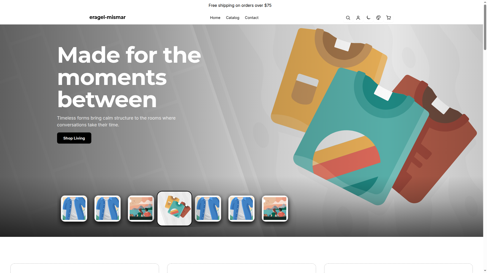

### Homepage and section frames

- [Full homepage](motion-ad-screenshots/homepage-full.png) · [Mobile homepage](motion-ad-screenshots/homepage-mobile.png)
- [Showcase homepage](motion-ad-screenshots/pages/showcase-home.png) · [Full showcase homepage](motion-ad-screenshots/pages/showcase-home-full.png)
- [Values and collections](motion-ad-screenshots/values-and-collections.png) · [Featured collection](motion-ad-screenshots/featured-collection.png) · [Product story](motion-ad-screenshots/product-story.png)
- [Journal](motion-ad-screenshots/journal.png) · [Newsletter](motion-ad-screenshots/newsletter.png) · [Footer](motion-ad-screenshots/footer.png)

### Store pages

<table>
  <tr>
    <td><strong>Showcase homepage</strong><br><a href="motion-ad-screenshots/pages/showcase-home.png">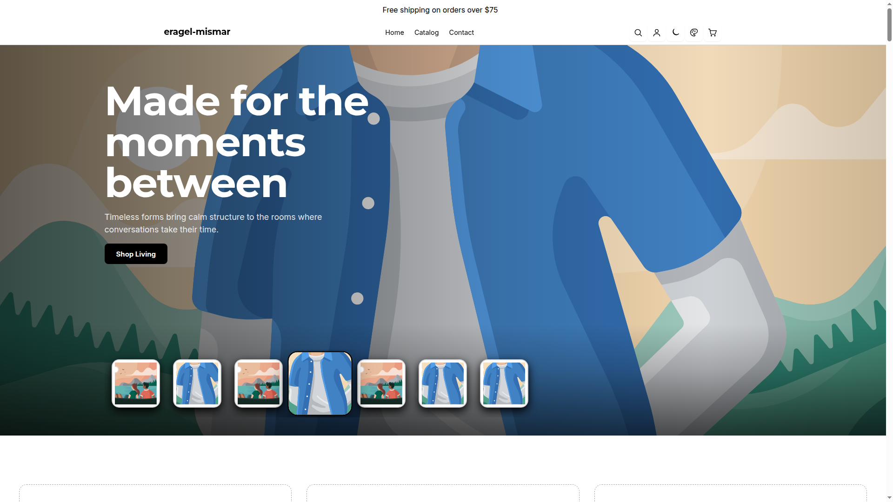</a></td>
    <td><strong>Collections index</strong><br><a href="motion-ad-screenshots/pages/collection-list.png">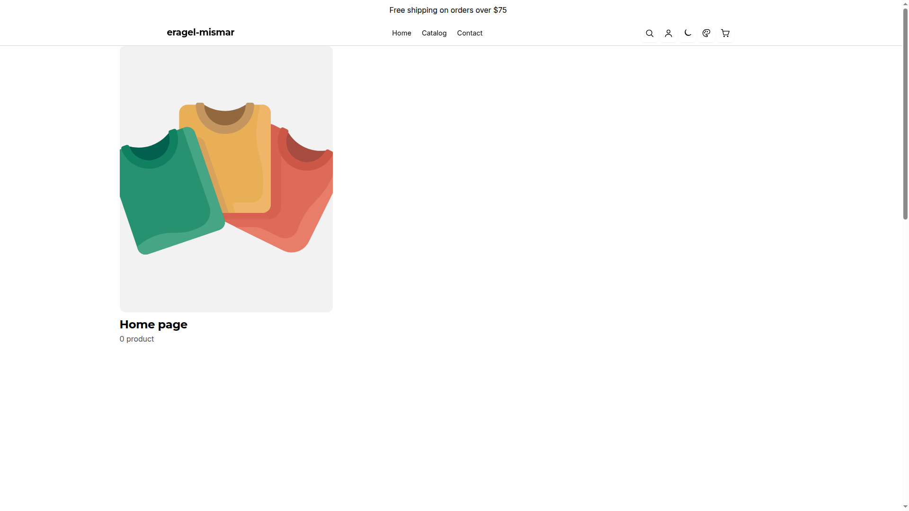</a></td>
  </tr>
  <tr>
    <td><strong>Catalog</strong><br><a href="motion-ad-screenshots/pages/catalog.png">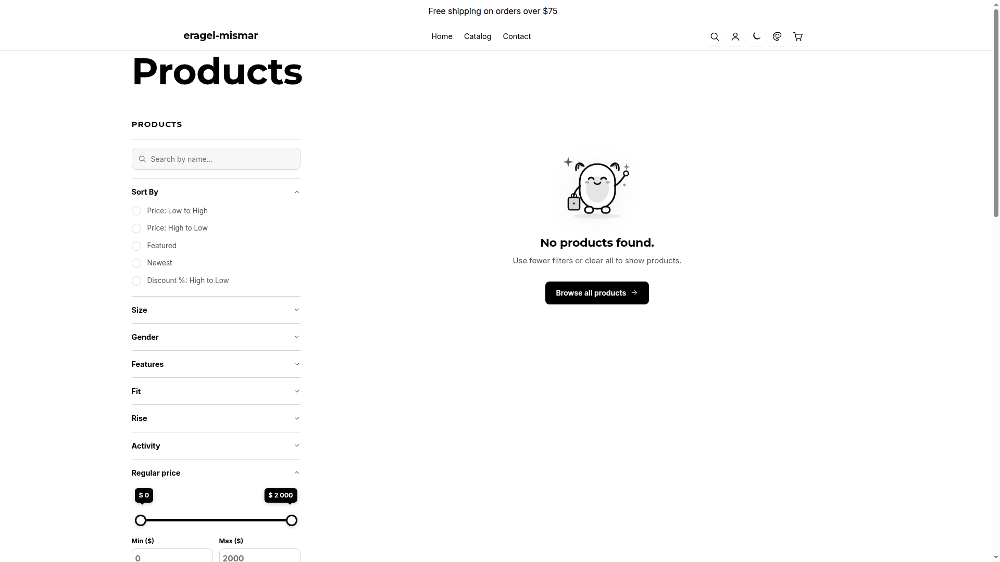</a></td>
    <td><strong>Contact</strong><br><a href="motion-ad-screenshots/pages/contact.png">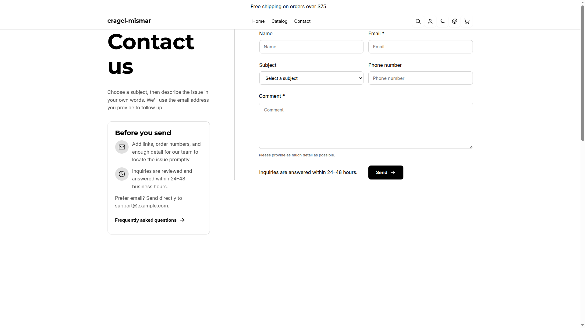</a></td>
  </tr>
  <tr>
    <td><strong>News blog</strong><br><a href="motion-ad-screenshots/pages/blog-news.png">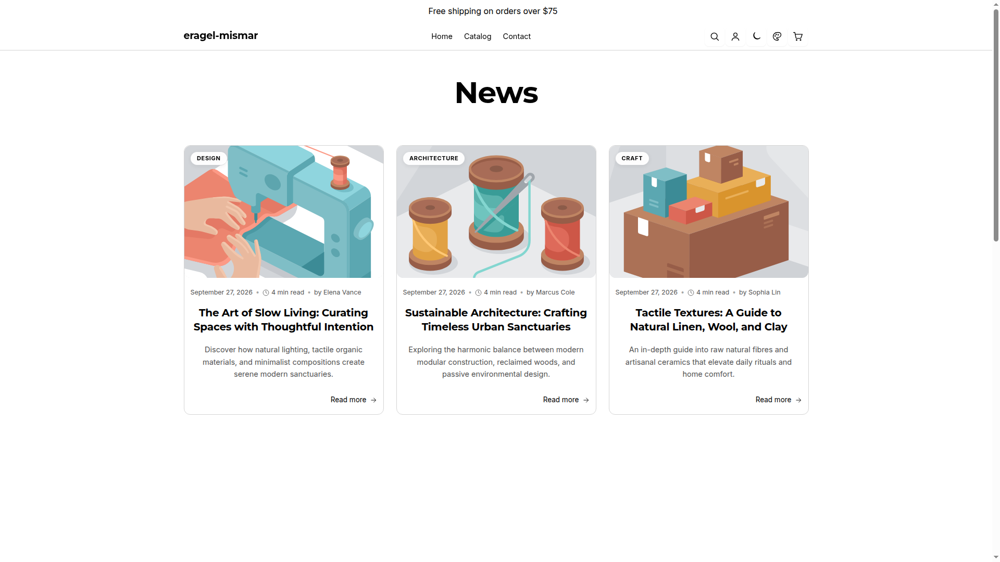</a></td>
    <td><strong>Search results</strong><br><a href="motion-ad-screenshots/pages/search-results.png">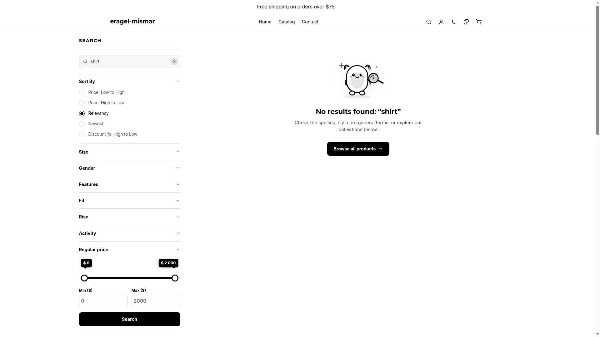</a></td>
  </tr>
  <tr>
    <td><strong>Empty cart</strong><br><a href="motion-ad-screenshots/pages/empty-cart.png">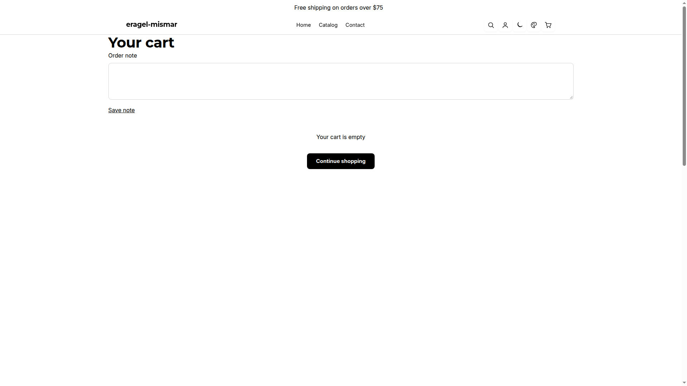</a></td>
    <td><strong>Privacy policy</strong><br><a href="motion-ad-screenshots/pages/privacy-policy.png">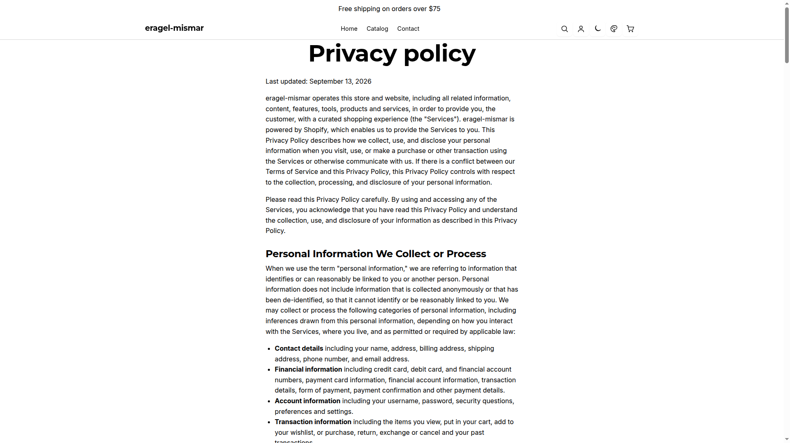</a></td>
  </tr>
  <tr>
    <td><strong>Sample product — XM1</strong><br><a href="motion-ad-screenshots/pages/sample-sneaker-xm1.png">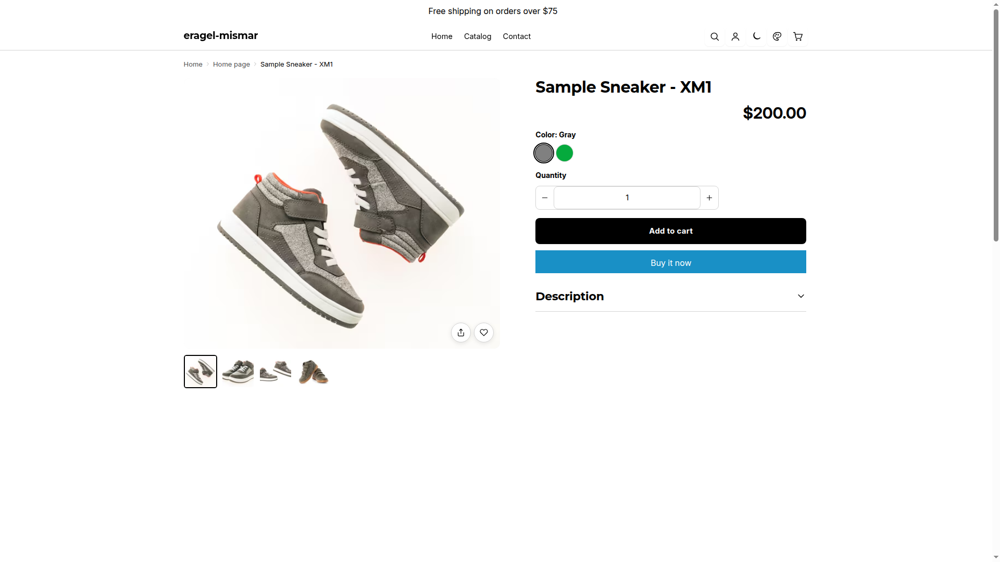</a></td>
    <td><strong>Published article</strong><br><a href="motion-ad-screenshots/pages/article-fashion-nova.png">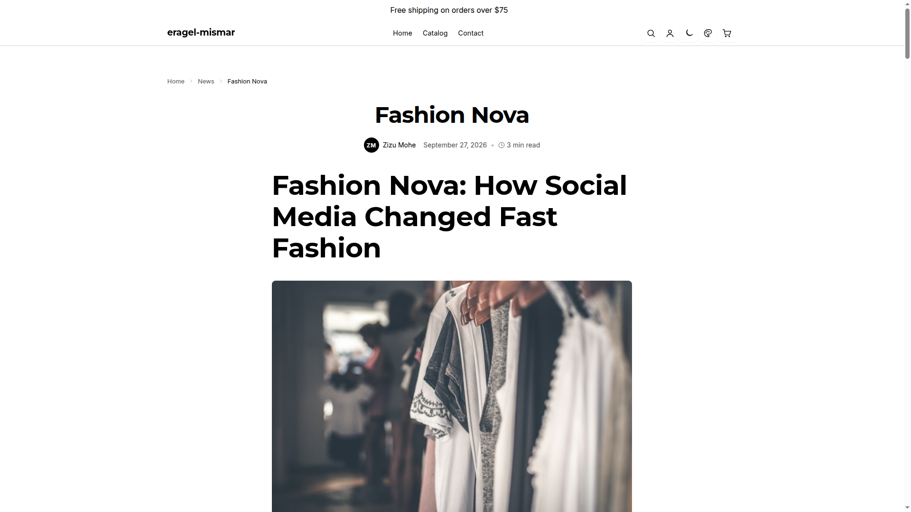</a></td>
  </tr>
</table>

### Product and article routes

The local preview exposes one product, **Sample Sneaker - XM1** (`/products/sample-sneaker-xm1`), with a working product page. The catalog and collections pages currently display zero products. Article resource `636449259625` is available at `/blogs/news/fashion-nova`; the supplied `/articles/636449259625` route returns 502 in the local preview, so the capture uses the working canonical route. About, FAQ, Track Order, Shipping, Size Guide, Refund Policy, and Terms of Service routes fall back to the same [404 page](motion-ad-screenshots/pages/unavailable-route-404.png).

- [Full showcase homepage](motion-ad-screenshots/pages/showcase-home-full.png) · [Full sample product page](motion-ad-screenshots/pages/sample-sneaker-xm1-full.png) · [Full article page](motion-ad-screenshots/pages/article-fashion-nova-full.png) · [Mobile homepage](motion-ad-screenshots/homepage-mobile.png)

## License

Framework is released under the [MIT License](LICENSE). You are free to use, modify, and redistribute the code under its terms. The license retains attribution for portions derived from the Lumen theme.
