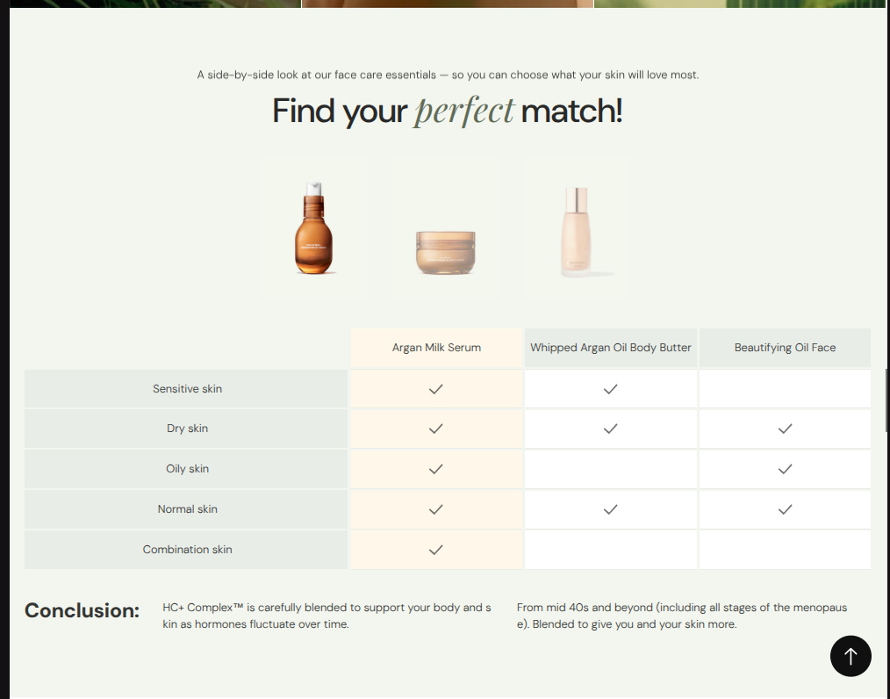

# Comparison Table Section

The `comparison-table` section enables merchants to present a high-clarity, side-by-side product matrix comparing 2 to 5 offerings (1 primary product + up to 4 alternatives/competitors).

## Visual & Structural Anatomy

1. **Section Header (Toggable)**:
   - Descriptive subtitle/eyebrow orienting the shopper.
   - Prominent headline with customizable editorial italic emphasis (`*accent word*`).
   - Can be completely disabled via `show_header`.
2. **Product Media Row (Toggable)**:
   - Dedicated photography container for each compared column with zoom-on-hover interaction.
   - Supports custom uploads (`image_picker`), direct Liquid theme product association (`product`), or built-in SVG skincare fallback illustrations (`serum`, `jar`, `oil`, `tube`, `dropper`).
   - Can be disabled via `show_column_images`.
3. **Column Titles Header Row (Toggable)**:
   - Prominent titles identifying each compared product.
   - First column highlighted with custom warm tint background (`col_1_highlight`).
   - Can be disabled via `show_column_titles`.
4. **Feature Comparison Rows (Dynamic Blocks)**:
   - Unlimited draggable blocks (`row`).
   - Feature label column on the left with soft background tint (`#EDF2EE`).
   - Per-column values supporting Checkmarks (`✓`), Crosses (`✕`), Dashes (`—`), Blank cells, or Custom text strings.
5. **Composable Editorial Notes & Takeaways**:
   - Add modular `heading`, `text` (with muted color role), `group`, or `button` blocks above or below the comparison table for conclusions, disclaimers, and takeaways.
6. **Responsive Matrix Behavior**:
   - On desktop, displays balanced columns with fixed proportions.
   - On mobile devices (< 768px), enables smooth horizontal scroll with a `sticky` left feature label column so context is never lost.
