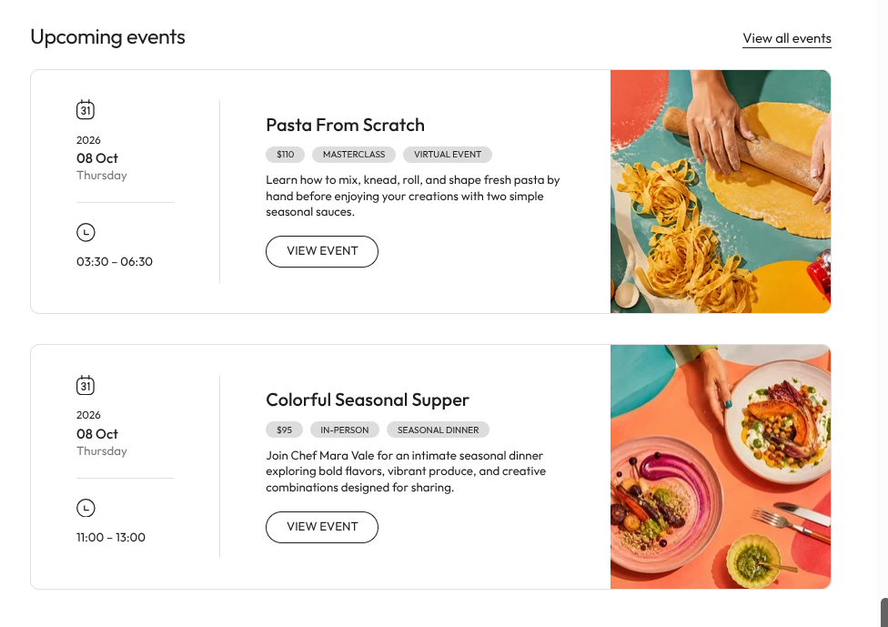

# Events List Section

The `events-list` section provides a dedicated, structured showcase for workshops, culinary classes, masterclasses, tasting dinners, community meetups, and experiential brand events.

## Visual & Structural Anatomy

1. **Header Zone**:
   - Left-aligned primary display title (`Upcoming events`) and optional context description.
   - Right-aligned clean text link (`View all events`) with distinct underline accent.
2. **Tri-Column Event Cards**:
   - **Column 1 — Date & Schedule Sidebar**:
     - Custom calendar badge showing month date.
     - Hierarchical typography: Year, Large Date ("08 Oct"), and Weekday name ("Thursday").
     - Horizontal hairline divider.
     - Clock icon paired with event schedule duration ("03:30 – 06:30").
     - Vertical subtle border separating the schedule from event information.
   - **Column 2 — Content & Attributes**:
     - Prominent event headline.
     - Pill badges display critical attributes: Price (`$110`), Format (`MASTERCLASS` / `IN-PERSON`), Delivery (`VIRTUAL EVENT` / `SEASONAL DINNER`).
     - Engaging summary paragraph.
     - Outlined pill CTA button (`VIEW EVENT`) with responsive inverse hover animation.
   - **Column 3 — Full-Height Media Portrait**:
     - Edge-to-edge photography or bespoke interactive fallback SVG illustrations (`snippets/events-demo-svg.liquid`).
     - Micro-scale zoom hover interaction for visual dynamism.

## Responsive Behavior

- **Desktop (≥ 980px)**: Three-column layout (`210px minmax(0, 1fr) 380px`).
- **Tablet (840px – 979px)**: Proportional contraction to maintain card balance.
- **Mobile (< 840px)**:
  - Hero event image stacks to the top of the card (`height: 240px`).
  - Schedule sidebar transforms into an intuitive top info bar.
  - Content details and CTA button retain clear readability and thumb-friendly tap targets.
